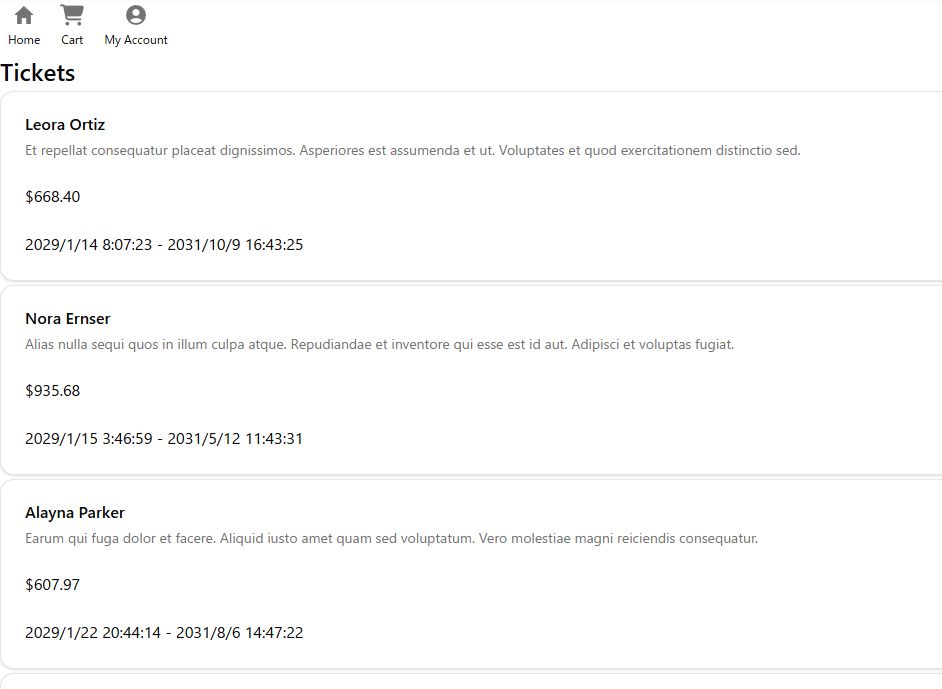
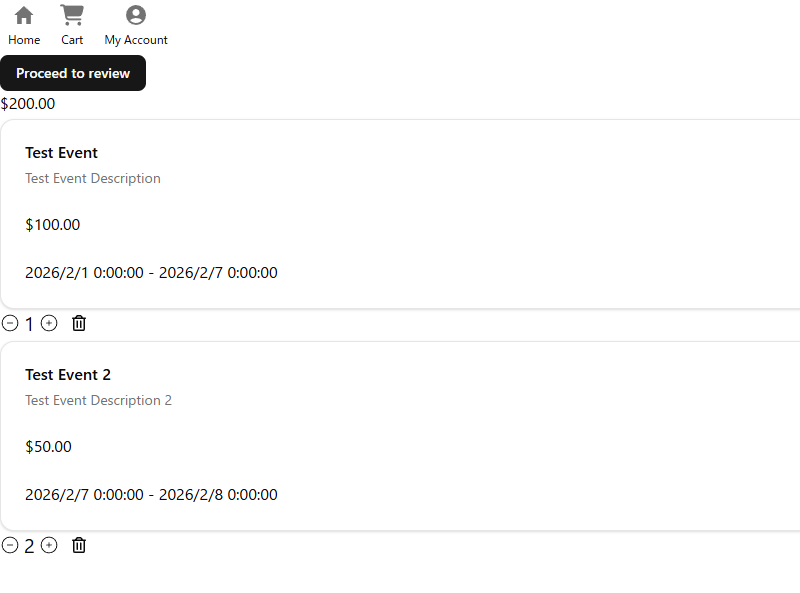
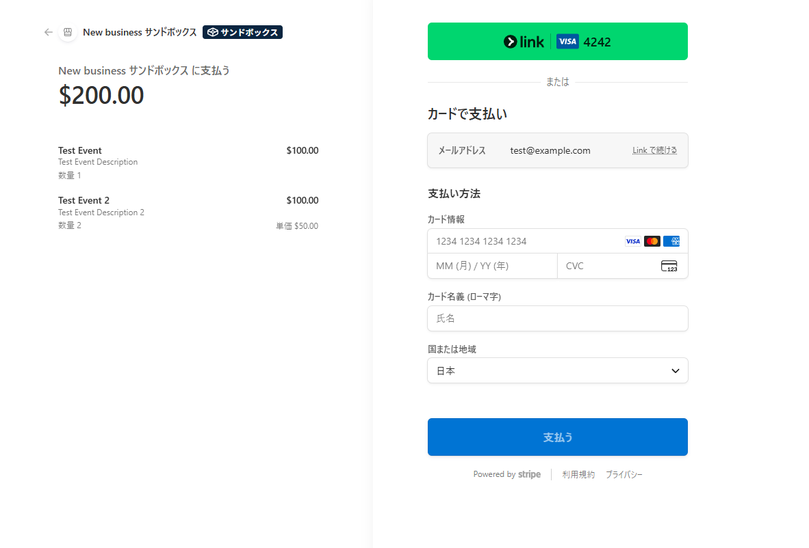
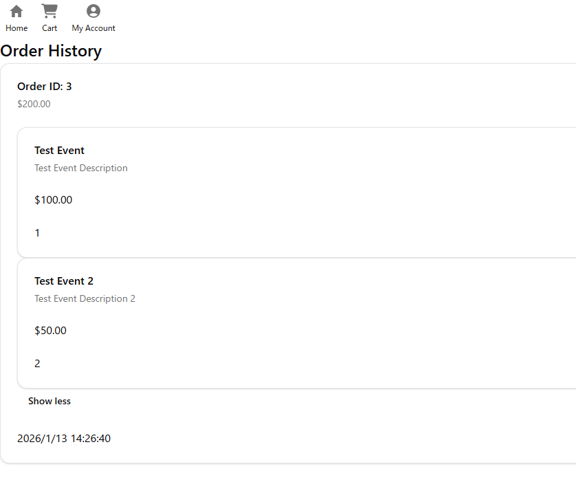
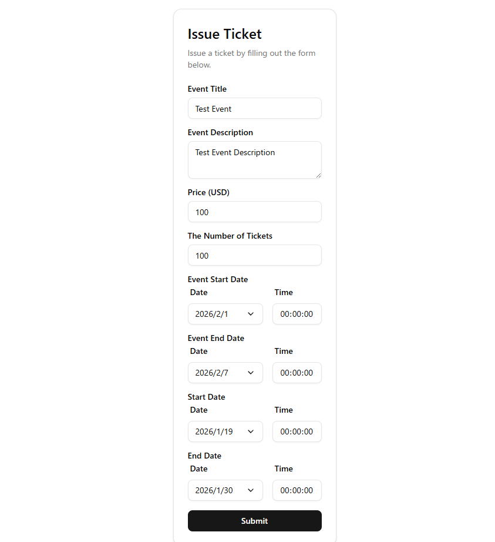
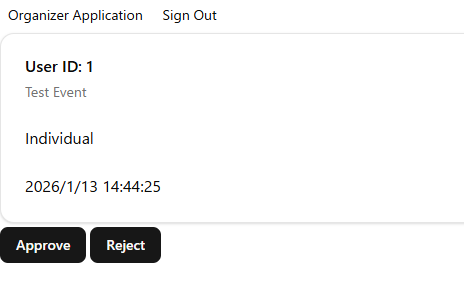
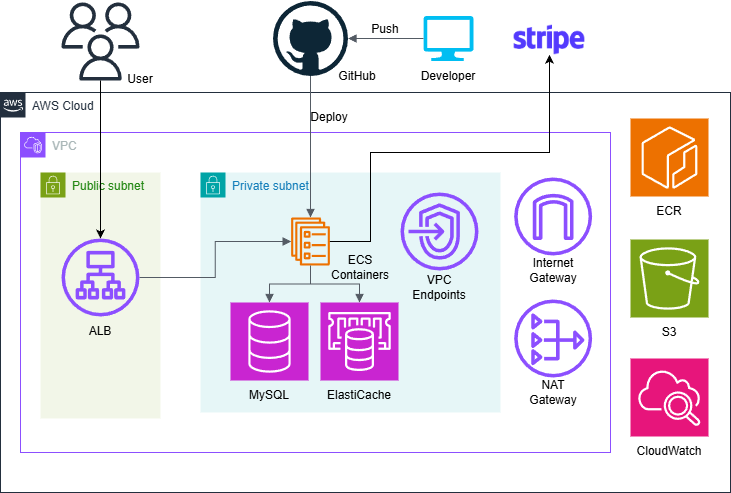

## Ticket Sales
This is a portfolio project for a ticket sales EC site. I used full-stack technologies, but I focused mainly on backend development.  
I built this project to practice designing a production-ready backend, including payment processing and concurrency control.

This project features automated deployment to AWS using GitHub Actions.  
Access to the live application is available upon request to help reduce hosting costs.

### Screenshots
Screenshots are intentionally minimal, as this project focuses on backend
architecture rather than UI design.

#### Home


#### Cart
Uses Valkey to manage cart state.  
Manages reserved stock using database transactions.



#### Stripe Checkout
Stripe Checkout with webhook-based order confirmation.  
(`4242` is a part of Stripe test card number.)



#### Order History


#### Purchased Ticket
The QR code can only be scanned by the organizer of the ticket.


#### Organizer Ticket Editor


#### Admin Organizer Approval


## Technologies Used (Back end)
- Laravel 12
- Nginx
- PHP 8.2
- Composer
- PostgreSQL 17.6
- Valkey
- Docker / Docker Compose
- Stripe
- GitHub Actions
- AWS
  - Amazon ECS (Fargate)
  - Amazon RDS
  - Amazon ElastiCache
  - Amazon ECR
  - Amazon S3
  - Amazon CloudWatch
  - Application Load Balancer
  - VPC Endpoint
  - NAT Gateway

### Automated Testing / CI
This project includes PHPUnit tests set up with GitHub Actions.  
Tests run automatically before the deployment.  
Workflow file: `.github/workflows/phpunit.yml`

## Technologies Used (Front end)
- HTML
- CSS (Tailwind + Shadcn)
- TypeScript
- Inertia + React
- Vite (Asset Bundler)

## Architecture Diagram


## Features
### General User
- User Registration and Authentication (Sign Up / Sign In)
- Cart
- Secure checkout flow with stock and reserved stock management
- Ticket usage (QR code)
- Order History

### Organizer User
- Ticket Editor (Create / Update)

### Admin User
- Organizer Approval

## Getting Started
Follow these steps to get this project up and running locally.

### Prerequisites
- Docker / Docker Compose
- Stripe Account

### Installation
1. Clone this repository  
  ```bash
  git clone https://github.com/dino0320/ticket-sales.git
  cd ticket-sales
  ```

2. Start the services with Docker Compose  
  ```bash
  IS_NPM_BUILT=1 docker compose up -d
  ```

3. Start a Stripe local webhook listener  
  ```bash
  docker compose exec stripe bash
  stripe listen --forward-to web:80/stripe/webhook --api-key=<Your Stripe Secret Key>
  ```

4. Set your Stripe keys in the generated `.env` file  
  You should get your Stripe webhook secret key when you start the Stripe local listener.  
  ```.env
  STRIPE_KEY=<Your Stripe Public Key>
  STRIPE_SECRET=<Your Stripe Secret Key>
  STRIPE_WEBHOOK_SECRET=<Your Stripe Webhook Secret Key>
  ```

5. Access the app at http://localhost/home  

## What I Focused On
- Backend architecture and domain separation
- Transaction management for ticket inventory
- Stripe payment and webhook handling
- Automated testing for services, controllers, jobs, and event listeners
- CI/CD with GitHub Actions and AWS ECS

## Future Improvements
- Rate limiting for malicious attacks
- Creating a middleware for organizer users
- Search and filter features
- User-facing error handling and error messages
- Admin enhancements

## License

The Laravel framework is open-sourced software licensed under the [MIT license](https://opensource.org/licenses/MIT).
